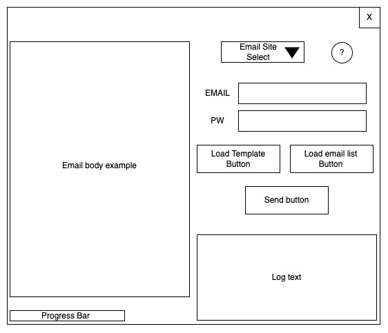

# 자동 이메일 보내는 프로그램

## 제작 이유

- 같은 형태의 이메일을 받는 사용자 명 등의 일부만 변경하고 보내야 하는 반복 업무가 존재
- 이러한 반복업무를 도와주는 프로그램은 존재하나 본인만의 자동 이메일 발송 프로그램을 Python을 활용하여 만들어봄

## 구현하고자 하는 기능

- 사용자가 보내고자 하는 이메일 사이트 지정
  - Gmail
  - Naver
  - Daum
- 사용자의 ID / Password 입력 받아 해당 사이트의 이메일 서비스 이용
- 사용자로부터 이메일 템플릿 및 템플릿의 placeholder를 대치할 때 사용하는 CSV 또는 XLS 파일을 선택 받음
- 이메일 템플릿에 placeholder가 대치 되었을 때의 예시를 앱을 통해 보여줌
- 템플릿에 맞춰 보내면 Progress Bar를 보여주며 동시에 진행 사항을 보여줌
- 로그 등을 다른 화면에 보여줌

## UI

### 디자인

### 실제 앱 결과

## 서비스 관계도

